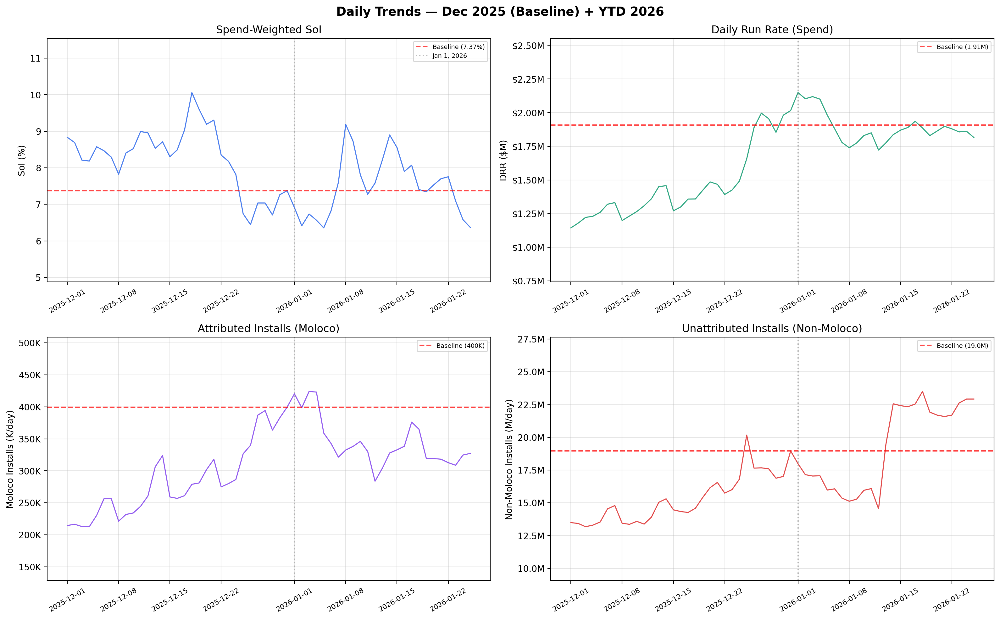
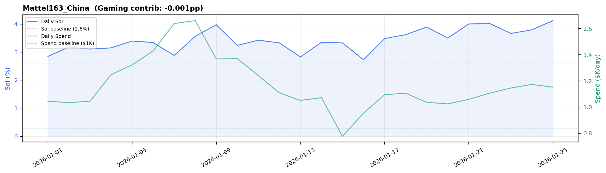
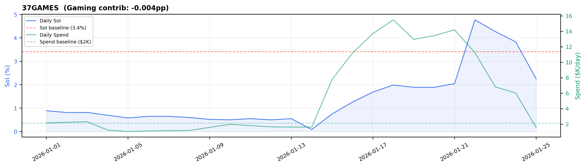
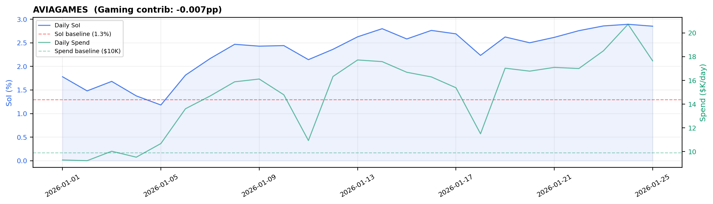
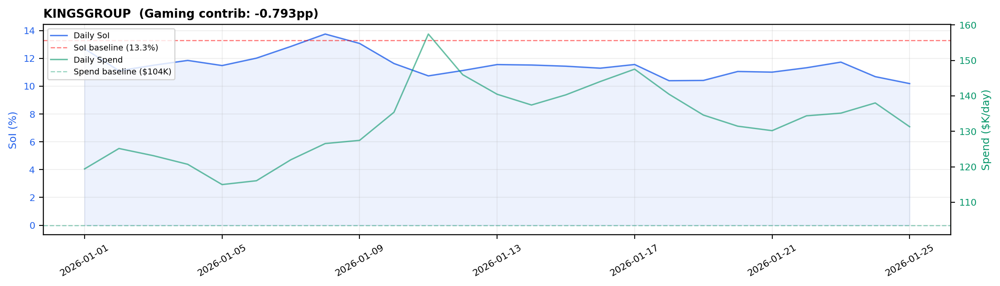
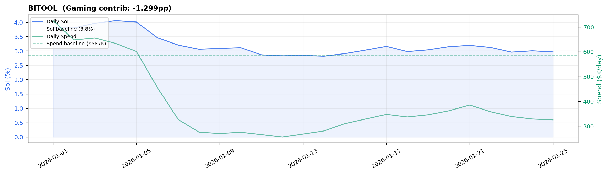
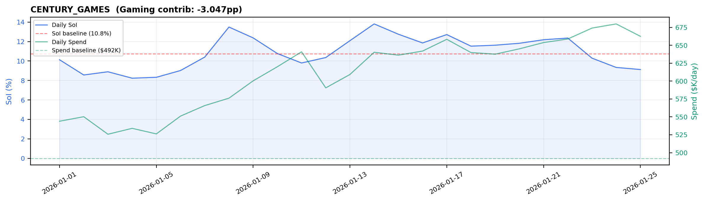
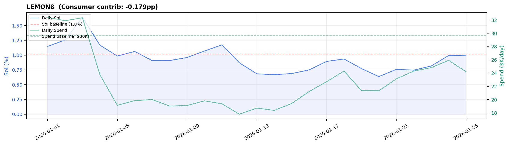
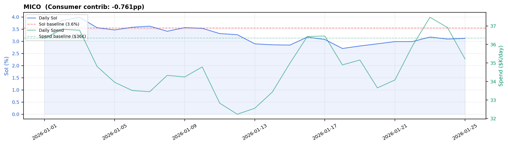
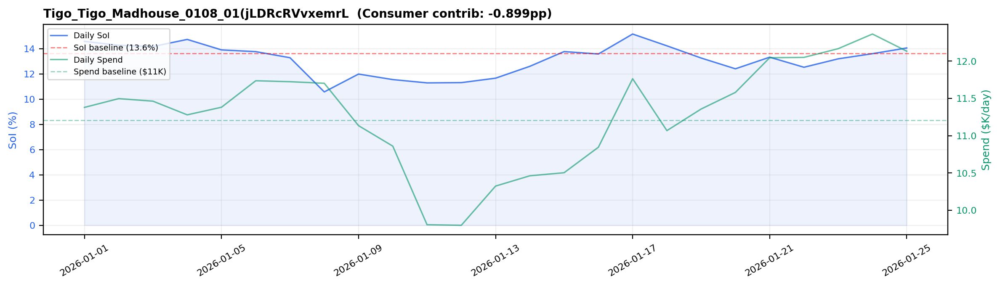

# Weekly Insights: 2026-W04 (as of 2026-01-25)

## TLDR

**Overall:** March (MTD) SoI is **0.00%** (-7.37%pp vs 7.37% baseline), the strongest month YTD. Monthly trajectory: 2026-01: 7.47%. YTD average is 7.47% (+0.09%pp), weighed down by the Feb dip. Gap to 9.37% target: **+1.91%pp** (need +0.17%pp/month over 11 months).

**Why the gap:** In March, Moloco installs are **-100%** vs baseline (399,549 -> 0/day) while unattributed installs are **-100%** (18,956,661 -> 0/day). Spend is healthy at $0/day (-100.0% vs baseline). This is an **install volume problem**, not a spend problem.

**Gaming vs Consumer (March MTD):**
- **Gaming:** SoI 0.00% (-7.88%pp vs baseline), DRR $0 (-100.0%), portfolio contribution **-7.177pp** (0% of spend)
- **Consumer:** SoI 0.00% (-1.97%pp vs baseline), DRR $0 (-100.0%), portfolio contribution **-0.176pp** (0% of spend)

**SoI x Spend Matrix (March MTD vs baseline, top 3 accounts per quadrant by DRR):**

*Gaming:*

| Quadrant | Account | Mar SoI | vs BL | Mar DRR | vs BL | Why |
| :--- | :--- | :--- | :--- | :--- | :--- | :--- |
| SoI Down + Spend Down | **CENTURY_GAMES** | 0.00% | -10.75% | $0 | -100.0% | Moloco installs dropped sharply (-100%) |
|  | **BITOOL** | 0.00% | -3.85% | $0 | -100.0% | Moloco installs dropped sharply (-100%) |
|  | **Dark War Survival_MADHOUS** | 0.00% | -3.32% | $0 | -100.0% | Moloco installs dropped sharply (-100%) |

*Consumer:*

| Quadrant | Account | Mar SoI | vs BL | Mar DRR | vs BL | Why |
| :--- | :--- | :--- | :--- | :--- | :--- | :--- |
| SoI Down + Spend Down | **TIKTOK_US** | 0.00% | -0.27% | $0 | -100.0% | Moloco installs dropped sharply (-100%) |
|  | **MICO** | 0.00% | -3.55% | $0 | -100.0% | Moloco installs dropped sharply (-100%) |
|  | **LEMON8** | 0.00% | -1.02% | $0 | -100.0% | Moloco installs dropped sharply (-100%) |

**Next Steps:**

**P1 — Assess SoI Down + Spend Down (25 accounts):** Pulling back — app-level review needed: is this intentional budget reallocation, seasonal pullback, or early churn signal? For accounts with sharp Moloco install drops, check for campaign pauses, creative fatigue, or the app shifting budget to other channels.
- Accounts: CENTURY_GAMES, BITOOL, Tigo_Tigo_Madhouse_0108_0, KINGSGROUP, EssentialsTech, MICO, Last Z_IOS_01(drb5MYyoQAz, MICROFUN, TOPGAMES, LEMON8, Wedobest_Screw Sort Puzzl, Luckymoney, TIKTOK_US, RIVERGAME_HK, LASTWAR, Lands of Jail_Madhouse_04, SPEELEAD, ZerooGravity, Dark War Survival_MADHOUS, Learnings, BYTEDANCEPTE, NetEase, AVIAGAMES, 37GAMES, Mattel163_China

---

## 1. Overall YTD Trends (Baseline: 2025-12-31)

| Metric | Baseline (2025-12-31) | Jan |
| :--- | :--- | :--- |
| **SoI** | 7.37% | 7.47% (+0.09%) |
| **DRR** | $1,906,704 | $1,889,049 (-1%) |
| **Moloco Inst/Day** | 399,549 | 343,739 (-14%) |
| **Non-Moloco Inst/Day** | 18,956,661 | 19,270,841 (+2%) |

---

## 2. Top SoI Drivers (March vs Baseline)

### Gaming

**Mattel163_China** | CHN Growth Top 2 | Mar DRR: $0 (-100.0%)

> Mar SoI 0.0% (-2.58%pp vs baseline), contrib -0.001pp — Moloco installs dropped -100%, dragging share down.

**37GAMES** | CHN Growth 2 | Mar DRR: $0 (-100.0%)

> Mar SoI 0.0% (-3.42%pp vs baseline), contrib -0.004pp — Moloco installs dropped -100%, dragging share down.

**AVIAGAMES** | CHN Growth Top 2 | Mar DRR: $0 (-100.0%)

> Mar SoI 0.0% (-1.29%pp vs baseline), contrib -0.007pp — Moloco installs dropped -100%, dragging share down.

---

## 3. Top SoI Drags (March vs Baseline)

### Gaming

**KINGSGROUP** | CHN Growth Top 2 | Mar DRR: $0 (-100.0%)

> Mar SoI 0.0% (-13.30%pp vs baseline), contrib -0.793pp — Moloco installs dropped -100%, dragging share down.

**BITOOL** | CHN Growth Top 3 | Mar DRR: $0 (-100.0%)

> Mar SoI 0.0% (-3.85%pp vs baseline), contrib -1.299pp — Moloco installs dropped -100%, dragging share down.

**CENTURY_GAMES** | CHN Growth Top 3 | Mar DRR: $0 (-100.0%)

> Mar SoI 0.0% (-10.75%pp vs baseline), contrib -3.047pp — Moloco installs dropped -100%, dragging share down.

### Consumer

**LEMON8** | CHN Growth Top 1 | Mar DRR: $0 (-100.0%)

> Mar SoI 0.0% (-1.02%pp vs baseline), contrib -0.179pp — Moloco installs dropped -100%, dragging share down.

**MICO** | CHN Growth Top 1 | Mar DRR: $0 (-100.0%)

> Mar SoI 0.0% (-3.55%pp vs baseline), contrib -0.761pp — Moloco installs dropped -100%, dragging share down.

**Tigo_Tigo_Madhouse_0108_01(jLDRcRVvxemrL4Q4)** | CHN Growth 1 | Mar DRR: $0 (-100.0%)

> Mar SoI 0.0% (-13.62%pp vs baseline), contrib -0.899pp — Moloco installs dropped -100%, dragging share down.

---

## 4. Install & Spend Decomposition (March vs Baseline)

**Gaming:**
- *Drivers* (Mattel163_China, 37GAMES, AVIAGAMES): Avg Moloco installs -100%, unattributed -100%, spend -100% vs baseline.
- *Droppers* (KINGSGROUP, BITOOL, CENTURY_GAMES): Avg Moloco installs -100%, unattributed -100%, spend -100% vs baseline.

**Consumer:**
- *Droppers* (LEMON8, MICO, Tigo_Tigo_Madhouse_0): Avg Moloco installs -100%, unattributed -100%, spend -100% vs baseline.

---

## 5. All Accounts at a Glance

| Account | Pod | BL SoI | BL DRR | Jan SoI (vs BL) | Jan DRR (vs BL) | Vert Contrib |
| :--- | :--- | :--- | :--- | :--- | :--- | :--- |
| **CENTURY_GAMES** | CHN Growth Top 3 | 10.8% | $492,114 | 10.9% (+0.2%) | $610,528 (+24%) | -3.047pp |
| **BITOOL** | CHN Growth Top 3 | 3.8% | $586,718 | 3.4% (-0.5%) | $388,616 (-34%) | -1.299pp |
| **KINGSGROUP** | CHN Growth Top 2 | 13.3% | $103,515 | 11.5% (-1.8%) | $132,784 (+28%) | -0.793pp |
| **EssentialsTech** | CHN Growth Top 2 | 14.9% | $92,260 | 13.7% (-1.2%) | $101,819 (+10%) | -0.790pp |
| **LASTWAR** | CHN Growth Top 2 | 3.1% | $69,608 | 4.2% (+1.1%) | $90,637 (+30%) | -0.124pp |
| **TIKTOK_US** | CHN Growth Top 1 | 0.3% | $79,827 | 0.2% (-0.1%) | $86,025 (+8%) | -0.128pp |
| **MICROFUN** | CHN Growth Top 3 | 7.1% | $61,269 | 5.5% (-1.6%) | $65,540 (+7%) | -0.250pp |
| **Last Z_IOS_01(drb5MYyoQAz** | CHN Growth 3 | 12.0% | $106,795 | 9.9% (-2.1%) | $87,656 (-18%) | -0.738pp |
| **Wedobest_Screw Sort Puzzl** | CHN Growth Top 3 | 6.6% | $41,139 | 5.0% (-1.5%) | $49,399 (+20%) | -0.156pp |
| **Luckymoney** | CHN Growth Top 2 | 6.4% | $36,531 | 6.5% (+0.1%) | $39,235 (+7%) | -0.134pp |
| **Learnings** | CHN Growth Top 2 | 1.2% | $25,168 | 1.0% (-0.1%) | $37,846 (+50%) | -0.017pp |
| **MICO** | CHN Growth Top 1 | 3.6% | $36,348 | 3.3% (-0.3%) | $34,849 (-4%) | -0.761pp |
| **LEMON8** | CHN Growth Top 1 | 1.0% | $29,683 | 1.0% (-0.1%) | $22,583 (-24%) | -0.179pp |
| **TOPGAMES** | CHN Growth Top 2 | 16.8% | $21,444 | 14.1% (-2.7%) | $22,617 (+5%) | -0.207pp |
| **AVIAGAMES** | CHN Growth Top 2 | 1.3% | $9,915 | 2.4% (+1.1%) | $14,842 (+50%) | -0.007pp |
| **ZerooGravity** | CHN Growth 3 | 6.0% | $11,100 | 4.4% (-1.6%) | $12,192 (+10%) | -0.038pp |
| **SPEELEAD** | CHN Growth 3 | 8.9% | $12,514 | 6.7% (-2.2%) | $12,521 (+0%) | -0.064pp |
| **BYTEDANCEPTE** | CHN Growth Top 1 | 0.2% | $12,672 | 0.2% (-0.0%) | $12,184 (-4%) | -0.016pp |
| **Tigo_Tigo_Madhouse_0108_0** | CHN Growth 1 | 13.6% | $11,204 | 13.2% (-0.4%) | $11,297 (+1%) | -0.899pp |
| **RIVERGAME_HK** | CHN Growth 3 | 6.9% | $31,674 | 6.3% (-0.7%) | $20,500 (-35%) | -0.127pp |
| **37GAMES** | CHN Growth 2 | 3.4% | $2,159 | 2.0% (-1.4%) | $5,488 (+154%) | -0.004pp |
| **NetEase** | CHN Growth Top 2 | 1.4% | $15,050 | 1.1% (-0.3%) | $12,564 (-17%) | -0.012pp |
| **Lands of Jail_Madhouse_04** | CHN Growth 2 | 22.2% | $6,969 | 9.5% (-12.7%) | $7,855 (+13%) | -0.089pp |
| **Dark War Survival_MADHOUS** | CHN Growth 3 | 3.3% | $9,581 | 2.3% (-1.0%) | $8,025 (-16%) | -0.018pp |
| **Mattel163_China** | CHN Growth Top 2 | 2.6% | $840 | 3.4% (+0.9%) | $1,170 (+39%) | -0.001pp |

---

> **How to read Vertical Contribution (pp)**
>
> Contribution is calculated **within each vertical** (Gaming and Consumer separately). Each account's contribution measures how many percentage-points it adds to (or subtracts from) its vertical's SoI change vs baseline.
>
> It depends on **two things**: (1) whether the account's SoI went up or down, and (2) how big a slice of its vertical's spend it represents.
>
> - A large-spend Gaming account with a small SoI drop can drag Gaming SoI down significantly (e.g. BITOOL: large share of Gaming spend).
> - A small Consumer account with a big SoI gain barely moves Consumer SoI (small share of Consumer spend).
> - An account can show *negative contribution even when its own SoI improved* — this happens when its spend share within the vertical shrank.
>
> Formula: `contribution = (account Mar SoI × share of vertical Mar spend) − (account baseline SoI × share of vertical baseline spend)`

*Generated 2026-03-14 19:14. All SoI values are spend-weighted. Metrics use March (MTD) average (Mar 1 – 2026-01-25) vs baseline unless noted. Monthly trajectory and Section 1 table show Jan–Mar for context.*