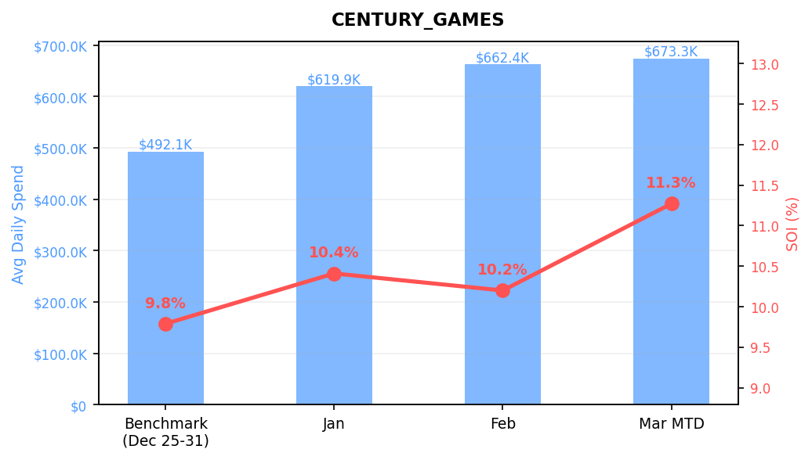
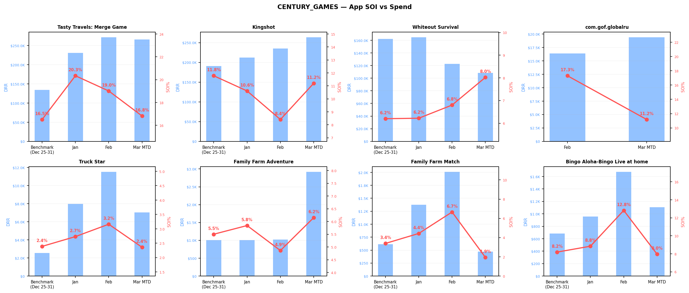
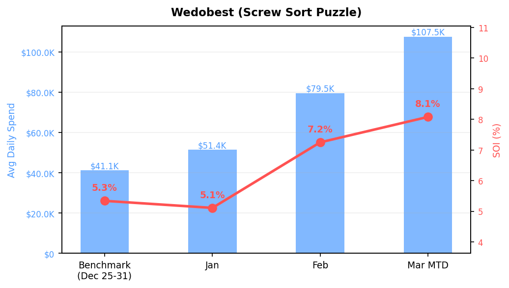
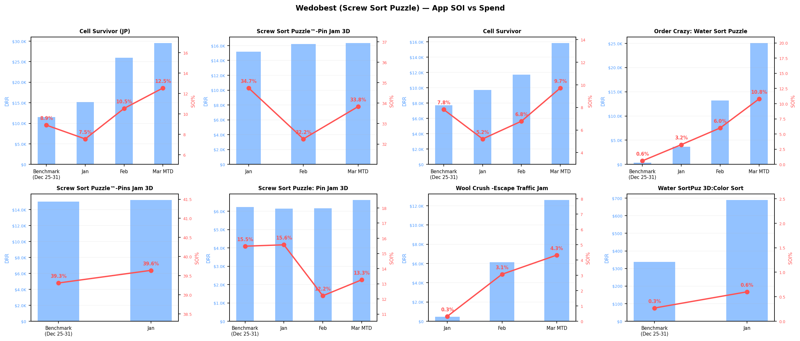
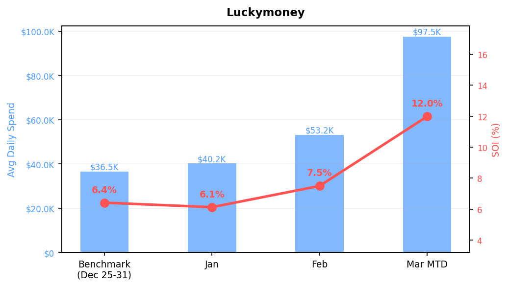
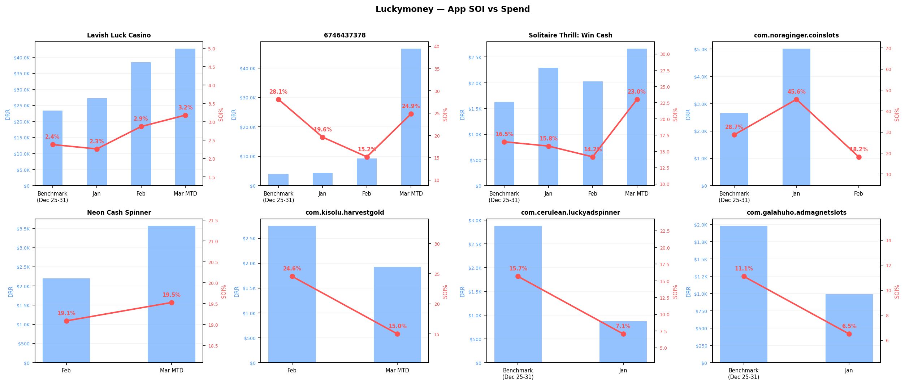
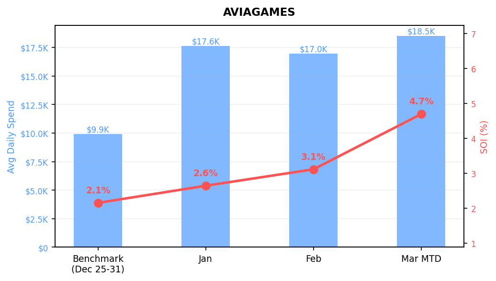
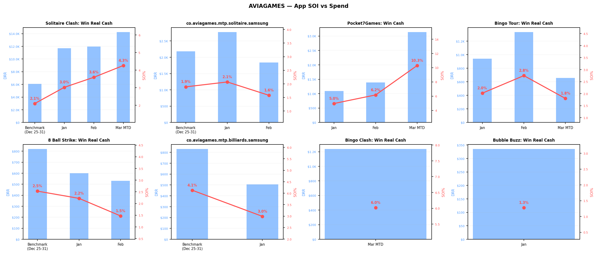
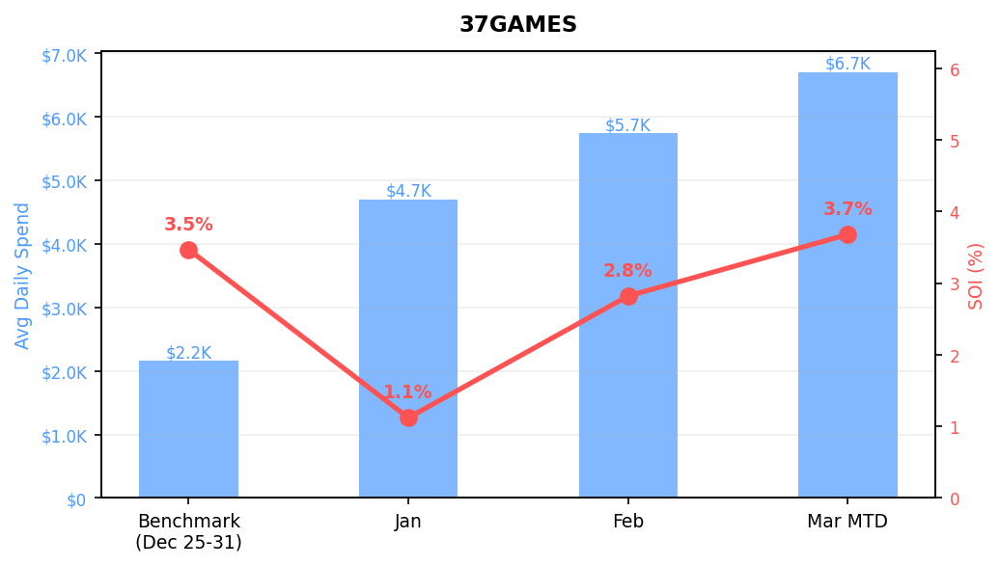
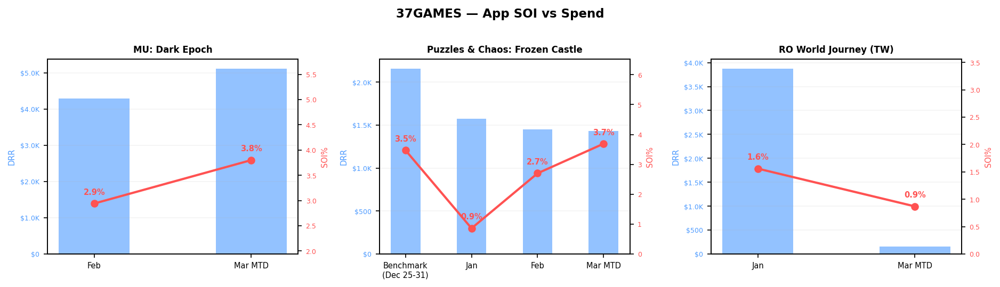

# P0 Protect: SOI Up + Spend Up — Deep Dive

**Accounts:** CENTURY_GAMES, Wedobest (Screw Sort Puzzle), Luckymoney, AVIAGAMES, 37GAMES

**Period:** Benchmark (Dec 25-31, 2025) through Mar 1-13, 2026

**Criteria:** Both average daily spend AND SOI increased in March vs Benchmark

> **SOI calculation:** At account level = naive sum(Moloco installs) / sum(all installs). Multi-account aggregation uses spend-weighted approach.

---

## Table of Contents

1. [CENTURY_GAMES](#century_games)
2. [Wedobest (Screw Sort Puzzle)](#wedobest--screw-sort-puzzle)
3. [Luckymoney](#luckymoney)
4. [AVIAGAMES](#aviagames)
5. [37GAMES](#37games)

---

## CENTURY_GAMES

| Period | Total Spend | Avg Daily Spend | Moloco Inst | Non-Moloco Inst | SOI |
| :--- | ---: | ---: | ---: | ---: | ---: |
| Benchmark | $3,444,799 | $492,114 | 420,440 | 3,875,767 | 9.79% |
| Jan | $19,216,895 | $619,900 | 1,918,335 | 16,514,912 | 10.41% |
| Feb | $18,546,222 | $662,365 | 1,578,422 | 13,898,316 | 10.20% |
| Mar MTD | $8,753,049 | $673,311 | 721,132 | 5,677,592 | 11.27% |

### SOI Impact by App (Benchmark → Mar)

> Which apps are driving the overall SOI change? **SOI Impact** = change in app's Moloco install share of total installs.

| App | BM SOI | Mar SOI | SOI Chg | Mar DRR | Spend % | SOI Impact (pp) |
| :--- | ---: | ---: | ---: | ---: | ---: | ---: |
| **com.gof.globalru** | — | 11.18% | +11.18% | $19,398 | 2.9% | +0.566 |
| **com.fatr.global** | — | 73.48% | +73.48% | $1,909 | 0.3% | +0.527 |
| **Tasty Travels: Merge Game** | 16.51% | 16.82% | +0.31% | $265,741 | 39.5% | +0.422 |
| **Hotel Manor: Merge Game** | — | 58.63% | +58.63% | $1,973 | 0.3% | +0.247 |
| **Family Farm Adventure** | 5.50% | 6.15% | +0.66% | $2,918 | 0.4% | +0.076 |
| **Truck Star** | 2.39% | 2.36% | -0.03% | $7,043 | 1.0% | +0.045 |
| **Bingo Aloha-Vegas Bingo Games** | — | 7.18% | +7.18% | $818 | 0.1% | +0.008 |
| **Bingo Aloha-Bingo Live at home** | 8.19% | 7.96% | -0.23% | $1,105 | 0.2% | +0.001 |
| **Family Farm Match** | 3.39% | 1.94% | -1.45% | $472 | 0.1% | -0.007 |
| **Kingshot** | 11.78% | 11.20% | -0.58% | $263,747 | 39.2% | -0.047 |
| **Whiteout Survival** | 6.20% | 8.02% | +1.82% | $108,487 | 16.1% | -0.353 |

### App-Level SOI vs Spend

### App-Level Raw Data

| App | Benchmark DRR | Benchmark SOI | Jan DRR | Jan SOI | Feb DRR | Feb SOI | Mar MTD DRR | Mar MTD SOI |
| :--- | ---: | ---: | ---: | ---: | ---: | ---: | ---: | ---: |
| **Tasty Travels: Merge Game** | $134,002 | 16.51% | $231,062 | 20.34% | $271,740 | 19.01% | $265,741 | 16.82% |
| **Kingshot** | $191,046 | 11.78% | $212,431 | 10.61% | $234,941 | 8.41% | $263,747 | 11.20% |
| **Whiteout Survival** | $162,212 | 6.20% | $164,834 | 6.22% | $122,552 | 6.80% | $108,487 | 8.02% |
| **com.gof.globalru** | — | — | — | — | $16,376 | 17.30% | $19,398 | 11.18% |
| **Truck Star** | $2,550 | 2.39% | $7,970 | 2.73% | $11,523 | 3.16% | $7,043 | 2.36% |
| **Family Farm Adventure** | $1,009 | 5.50% | $1,008 | 5.84% | $1,019 | 4.86% | $2,918 | 6.15% |
| **Family Farm Match** | $615 | 3.39% | $1,378 | 4.43% | $2,010 | 6.66% | $472 | 1.94% |
| **Bingo Aloha-Bingo Live at home** | $681 | 8.19% | $957 | 8.84% | $1,674 | 12.82% | $1,105 | 7.96% |
| **Bingo Aloha-Vegas Bingo Games** | — | — | $402 | 5.11% | $1,113 | 7.22% | $818 | 7.18% |
| **Hotel Manor: Merge Game** | — | — | — | — | — | — | $1,973 | 58.63% |
| **com.fatr.global** | — | — | — | — | — | — | $1,909 | 73.48% |

---

## Wedobest (Screw Sort Puzzle)

| Period | Total Spend | Avg Daily Spend | Moloco Inst | Non-Moloco Inst | SOI |
| :--- | ---: | ---: | ---: | ---: | ---: |
| Benchmark | $287,976 | $41,139 | 70,770 | 1,254,124 | 5.34% |
| Jan | $1,592,180 | $51,361 | 424,292 | 7,873,729 | 5.11% |
| Feb | $2,226,959 | $79,534 | 500,429 | 6,398,026 | 7.25% |
| Mar MTD | $1,397,086 | $107,468 | 257,177 | 2,924,725 | 8.08% |

### SOI Impact by App (Benchmark → Mar)

> Which apps are driving the overall SOI change? **SOI Impact** = change in app's Moloco install share of total installs.

| App | BM SOI | Mar SOI | SOI Chg | Mar DRR | Spend % | SOI Impact (pp) |
| :--- | ---: | ---: | ---: | ---: | ---: | ---: |
| **Order Crazy: Water Sort Puzzle** | 0.59% | 10.78% | +10.19% | $25,051 | 23.3% | +1.694 |
| **Screw Sort Puzzle™-Pin Jam 3D** | — | 33.83% | +33.83% | $16,331 | 15.2% | +1.277 |
| **Wool Crush -Escape Traffic Jam** | — | 4.32% | +4.32% | $12,605 | 11.7% | +0.753 |
| **Cell Survivor** | 7.81% | 9.72% | +1.91% | $15,833 | 14.7% | +0.617 |
| **Cell Survivor (JP)** | 8.90% | 12.54% | +3.64% | $29,512 | 27.5% | +0.614 |
| **sheep.animal.parking.puzzle.ga** | — | 1.26% | +1.26% | $490 | 0.5% | +0.238 |
| **Sheep Away -Farm Animal Escape** | — | 1.99% | +1.99% | $1,024 | 1.0% | +0.204 |
| **Water SortPuz 3D:Color Sort** | 0.27% | — | -0.27% | — | — | -0.130 |
| **Screw Sort Puzzle: Pin Jam 3D** | 15.48% | 13.26% | -2.22% | $6,621 | 6.2% | -0.513 |
| **Screw Sort Puzzle™-Pins Jam 3D** | 39.31% | — | -39.31% | — | — | -2.013 |

### App-Level SOI vs Spend

### App-Level Raw Data

| App | Benchmark DRR | Benchmark SOI | Jan DRR | Jan SOI | Feb DRR | Feb SOI | Mar MTD DRR | Mar MTD SOI |
| :--- | ---: | ---: | ---: | ---: | ---: | ---: | ---: | ---: |
| **Cell Survivor (JP)** | $11,506 | 8.90% | $15,184 | 7.55% | $25,925 | 10.54% | $29,512 | 12.54% |
| **Screw Sort Puzzle™-Pin Jam 3D** | — | — | $15,182 | 34.74% | $16,221 | 32.25% | $16,331 | 33.83% |
| **Cell Survivor** | $7,704 | 7.81% | $9,711 | 5.21% | $11,714 | 6.78% | $15,833 | 9.72% |
| **Order Crazy: Water Sort Puzzle** | $339 | 0.59% | $3,660 | 3.25% | $13,188 | 6.00% | $25,051 | 10.78% |
| **Screw Sort Puzzle™-Pins Jam 3D** | $15,017 | 39.31% | $15,216 | 39.64% | — | — | — | — |
| **Screw Sort Puzzle: Pin Jam 3D** | $6,235 | 15.48% | $6,154 | 15.57% | $6,158 | 12.21% | $6,621 | 13.26% |
| **Wool Crush -Escape Traffic Jam** | — | — | $479 | 0.32% | $6,129 | 3.07% | $12,605 | 4.32% |
| **Water SortPuz 3D:Color Sort** | $338 | 0.27% | $690 | 0.60% | — | — | — | — |
| **Sheep Away -Farm Animal Escape** | — | — | — | — | — | — | $1,024 | 1.99% |
| **Wool Crush - Yarn Color Sort** | — | — | $284 | 0.35% | $328 | 0.14% | — | — |
| **sheep.animal.parking.puzzle.ga** | — | — | — | — | — | — | $490 | 1.26% |

---

## Luckymoney

| Period | Total Spend | Avg Daily Spend | Moloco Inst | Non-Moloco Inst | SOI |
| :--- | ---: | ---: | ---: | ---: | ---: |
| Benchmark | $255,717 | $36,531 | 6,480 | 94,412 | 6.42% |
| Jan | $1,245,867 | $40,189 | 31,093 | 476,174 | 6.13% |
| Feb | $1,488,670 | $53,167 | 35,793 | 441,366 | 7.50% |
| Mar MTD | $1,267,334 | $97,487 | 28,610 | 210,199 | 11.98% |

### SOI Impact by App (Benchmark → Mar)

> Which apps are driving the overall SOI change? **SOI Impact** = change in app's Moloco install share of total installs.

| App | BM SOI | Mar SOI | SOI Chg | Mar DRR | Spend % | SOI Impact (pp) |
| :--- | ---: | ---: | ---: | ---: | ---: | ---: |
| **6746437378** | 28.10% | 24.86% | -3.24% | $46,616 | 47.8% | +5.761 |
| **Neon Cash Spinner** | — | 19.53% | +19.53% | $3,571 | 3.7% | +1.196 |
| **com.kisolu.harvestgold** | — | 15.01% | +15.01% | $1,924 | 2.0% | +0.685 |
| **Lavish Luck Casino** | 2.38% | 3.18% | +0.80% | $42,713 | 43.8% | -0.035 |
| **Solitaire Thrill: Win Cash** | 16.49% | 23.02% | +6.53% | $2,664 | 2.7% | -0.161 |
| **com.cerulean.luckyadspinner** | 15.67% | — | -15.67% | — | — | -0.437 |
| **com.galahuho.admagnetslots** | 11.10% | — | -11.10% | — | — | -0.578 |
| **com.noraginger.coinslots** | 28.69% | — | -28.69% | — | — | -0.874 |

### App-Level SOI vs Spend

### App-Level Raw Data

| App | Benchmark DRR | Benchmark SOI | Jan DRR | Jan SOI | Feb DRR | Feb SOI | Mar MTD DRR | Mar MTD SOI |
| :--- | ---: | ---: | ---: | ---: | ---: | ---: | ---: | ---: |
| **Lavish Luck Casino** | $23,401 | 2.38% | $27,223 | 2.26% | $38,512 | 2.87% | $42,713 | 3.18% |
| **6746437378** | $3,987 | 28.10% | $4,288 | 19.60% | $9,270 | 15.18% | $46,616 | 24.86% |
| **Solitaire Thrill: Win Cash** | $1,625 | 16.49% | $2,296 | 15.83% | $2,026 | 14.17% | $2,664 | 23.02% |
| **com.noraginger.coinslots** | $2,654 | 28.69% | $5,017 | 45.57% | $0 | 18.18% | — | — |
| **Neon Cash Spinner** | — | — | — | — | $2,197 | 19.09% | $3,571 | 19.53% |
| **com.kisolu.harvestgold** | — | — | — | — | $2,752 | 24.55% | $1,924 | 15.01% |
| **com.cerulean.luckyadspinner** | $2,880 | 15.67% | $872 | 7.07% | — | — | — | — |
| **com.galahuho.admagnetslots** | $1,982 | 11.10% | $988 | 6.50% | — | — | — | — |

---

## AVIAGAMES

| Period | Total Spend | Avg Daily Spend | Moloco Inst | Non-Moloco Inst | SOI |
| :--- | ---: | ---: | ---: | ---: | ---: |
| Benchmark | $69,403 | $9,915 | 3,917 | 178,145 | 2.15% |
| Jan | $546,935 | $17,643 | 34,126 | 1,257,485 | 2.64% |
| Feb | $474,979 | $16,964 | 27,047 | 842,512 | 3.11% |
| Mar MTD | $240,629 | $18,510 | 13,823 | 280,638 | 4.69% |

### SOI Impact by App (Benchmark → Mar)

> Which apps are driving the overall SOI change? **SOI Impact** = change in app's Moloco install share of total installs.

| App | BM SOI | Mar SOI | SOI Chg | Mar DRR | Spend % | SOI Impact (pp) |
| :--- | ---: | ---: | ---: | ---: | ---: | ---: |
| **Solitaire Clash: Win Real Cash** | 2.10% | 4.26% | +2.15% | $14,241 | 73.9% | +1.815 |
| **Pocket7Games: Win Cash** | — | 10.30% | +10.30% | $3,137 | 16.3% | +1.343 |
| **Bingo Tour: Win Real Cash** | — | 1.80% | +1.80% | $655 | 3.4% | +0.308 |
| **Bingo Clash: Win Real Cash** | — | 6.02% | +6.02% | $1,239 | 6.4% | +0.232 |
| **co.aviagames.mtp.billiards.sam** | 4.13% | — | -4.13% | — | — | -0.369 |
| **8 Ball Strike: Win Real Cash** | 2.53% | — | -2.53% | — | — | -0.387 |
| **co.aviagames.mtp.solitaire.sam** | 1.89% | — | -1.89% | — | — | -0.399 |

### App-Level SOI vs Spend

### App-Level Raw Data

| App | Benchmark DRR | Benchmark SOI | Jan DRR | Jan SOI | Feb DRR | Feb SOI | Mar MTD DRR | Mar MTD SOI |
| :--- | ---: | ---: | ---: | ---: | ---: | ---: | ---: | ---: |
| **Solitaire Clash: Win Real Cash** | $6,078 | 2.10% | $11,702 | 3.02% | $11,960 | 3.59% | $14,241 | 4.26% |
| **co.aviagames.mtp.solitaire.sam** | $2,185 | 1.89% | $2,771 | 2.07% | $1,838 | 1.58% | — | — |
| **Pocket7Games: Win Cash** | — | — | $1,095 | 4.97% | $1,387 | 6.17% | $3,137 | 10.30% |
| **Bingo Tour: Win Real Cash** | — | — | $940 | 2.02% | $1,333 | 2.75% | $655 | 1.80% |
| **8 Ball Strike: Win Real Cash** | $821 | 2.53% | $600 | 2.22% | $531 | 1.47% | — | — |
| **co.aviagames.mtp.billiards.sam** | $832 | 4.13% | $506 | 2.99% | — | — | — | — |
| **Bingo Clash: Win Real Cash** | — | — | — | — | — | — | $1,239 | 6.02% |
| **Bubble Buzz: Win Real Cash** | — | — | $335 | 1.28% | — | — | — | — |

---

## 37GAMES

| Period | Total Spend | Avg Daily Spend | Moloco Inst | Non-Moloco Inst | SOI |
| :--- | ---: | ---: | ---: | ---: | ---: |
| Benchmark | $15,111 | $2,159 | 1,897 | 52,787 | 3.47% |
| Jan | $145,819 | $4,704 | 13,248 | 1,165,840 | 1.12% |
| Feb | $160,650 | $5,737 | 11,458 | 395,006 | 2.82% |
| Mar MTD | $87,097 | $6,700 | 6,401 | 167,633 | 3.68% |

### SOI Impact by App (Benchmark → Mar)

> Which apps are driving the overall SOI change? **SOI Impact** = change in app's Moloco install share of total installs.

| App | BM SOI | Mar SOI | SOI Chg | Mar DRR | Spend % | SOI Impact (pp) |
| :--- | ---: | ---: | ---: | ---: | ---: | ---: |
| **MU: Dark Epoch** | — | 3.80% | +3.80% | $5,121 | 76.4% | +2.275 |
| **RO World Journey (TW)** | — | 0.87% | +0.87% | $151 | 2.2% | +0.024 |
| **Puzzles & Chaos: Frozen Castle** | 3.47% | 3.69% | +0.22% | $1,428 | 21.3% | -2.090 |

### App-Level SOI vs Spend

### App-Level Raw Data

| App | Benchmark DRR | Benchmark SOI | Jan DRR | Jan SOI | Feb DRR | Feb SOI | Mar MTD DRR | Mar MTD SOI |
| :--- | ---: | ---: | ---: | ---: | ---: | ---: | ---: | ---: |
| **MU: Dark Epoch** | — | — | — | — | $4,289 | 2.94% | $5,121 | 3.80% |
| **Puzzles & Chaos: Frozen Castle** | $2,159 | 3.47% | $1,576 | 0.86% | $1,449 | 2.70% | $1,428 | 3.69% |
| **RO World Journey (TW)** | — | — | $3,879 | 1.56% | — | — | $151 | 0.87% |

---

*Generated 2026-03-17. SOI = Moloco Installs / (Moloco + Non-Moloco Installs). DRR = Avg Daily Spend.*