# Weekly Insights: 2026-W09 (as of 2026-03-01)

## TLDR

**Overall:** March (MTD) SoI is **6.94%** (-0.43%pp vs 7.37% baseline), the strongest month YTD. Monthly trajectory: 2026-01: 7.31% -> 2026-02: 6.83% -> 2026-03: 6.94%. YTD average is 7.08% (-0.30%pp), weighed down by the Feb dip. Gap to 9.37% target: **+2.30%pp** (need +0.23%pp/month over 10 months).

**Why the gap:** In March, Moloco installs are **-14%** vs baseline (399,549 -> 344,384/day) while unattributed installs are **+24%** (18,956,661 -> 23,501,301/day). Spend is healthy at $2,050,930/day (+7.6% vs baseline). This is an **install volume problem**, not a spend problem.

**Gaming vs Consumer (March MTD):**
- **Gaming:** SoI 7.42% (-0.46%pp vs baseline), DRR $1,889,737 (+8.8%), portfolio contribution **-0.340pp** (92% of spend)
- **Consumer:** SoI 1.34% (-0.63%pp vs baseline), DRR $161,193 (-5.4%), portfolio contribution **-0.071pp** (8% of spend)

**SoI x Spend Matrix (March MTD vs baseline, top 3 accounts per quadrant by DRR):**

*Gaming:*

| Quadrant | Account | Mar SoI | vs BL | Mar DRR | vs BL | Why |
| :--- | :--- | :--- | :--- | :--- | :--- | :--- |
| SoI Up + Spend Up | **CENTURY_GAMES** | 10.98% | +0.23% | $698,737 | +42.0% | Scaling efficiently — Moloco outpacing market |
|  | **Wedobest_Screw Sort Puzzl** | 6.90% | +0.32% | $99,096 | +140.9% | Scaling efficiently — Moloco outpacing market |
|  | **Luckymoney** | 9.97% | +3.58% | $76,378 | +109.1% | Scaling efficiently — Moloco outpacing market |
| SoI Up + Spend Down | **LASTWAR** | 6.15% | +3.06% | $49,750 | -28.5% | Unattributed installs declining (-85%), shrinking denominator |
|  | **RIVERGAME_HK** | 14.71% | +7.76% | $3,965 | -87.5% | Unattributed installs declining (-68%), shrinking denominator |
| SoI Down + Spend Up | **MICROFUN** | 6.52% | -0.56% | $119,576 | +95.2% | Unattributed installs surged (+71%), diluting SoI despite higher spend |
|  | **KINGSGROUP** | 7.41% | -5.89% | $107,059 | +3.4% | Unattributed installs surged (+31%), diluting SoI despite higher spend |
|  | **Learnings** | 1.00% | -0.18% | $99,915 | +297.0% | Unattributed installs surged (+79%), diluting SoI despite higher spend |
| SoI Down + Spend Down | **BITOOL** | 3.56% | -0.28% | $415,216 | -29.2% | Proportional pullback |
|  | **EssentialsTech** | 9.01% | -5.85% | $83,720 | -9.3% | Proportional pullback |
|  | **Last Z_IOS_01(drb5MYyoQAz** | 3.82% | -8.19% | $33,920 | -68.2% | Moloco installs dropped sharply (-86%) |

*Consumer:*

| Quadrant | Account | Mar SoI | vs BL | Mar DRR | vs BL | Why |
| :--- | :--- | :--- | :--- | :--- | :--- | :--- |
| SoI Up + Spend Down | **Tigo_Tigo_Madhouse_0108_0** | 14.59% | +0.97% | $7,594 | -32.2% | Unattributed installs declining (-21%), shrinking denominator |
| SoI Down + Spend Up | **TIKTOK_US** | 0.14% | -0.13% | $99,178 | +24.2% | Unattributed installs surged (+72%), diluting SoI despite higher spend |
| SoI Down + Spend Down | **MICO** | 2.72% | -0.83% | $28,154 | -22.5% | Proportional pullback |
|  | **LEMON8** | 0.81% | -0.21% | $15,280 | -48.5% | Moloco installs dropped sharply (-36%) |
|  | **BYTEDANCEPTE** | 0.13% | -0.08% | $10,987 | -13.3% | Moloco installs dropped sharply (-40%) |

**Divergent accounts (opposite SoI vs Spend trends, March MTD):**
- **MICROFUN**: Spend +95% but SoI -0.56%pp — unattributed installs grew +71%, diluting share despite higher investment.
- **ZerooGravity**: Spend +111% but SoI -0.86%pp — unattributed installs grew +201%, diluting share despite higher investment.
- **37GAMES**: Spend +208% but SoI -0.56%pp — unattributed installs grew +123%, diluting share despite higher investment.
- **LASTWAR**: Spend -29% but SoI +3.06%pp — unattributed installs dropped -85%, shrinking denominator.
- **Tigo_Tigo_Madhouse_0108_0**: Spend -32% but SoI +0.97%pp — unattributed installs dropped -21%, shrinking denominator.
- **RIVERGAME_HK**: Spend -87% but SoI +7.76%pp — unattributed installs dropped -68%, shrinking denominator.

**Next Steps:**

**P0 — Accelerate SoI Up + Spend Down (3 accounts):** Biggest win opportunity — Moloco is already gaining share in these apps even as spend declines. App-level review: why is spend down? If we can restore or grow budget here, SoI gains should compound. Understand whether the app cut Moloco spend intentionally or if budget shifted to other channels we can win back.
- Accounts: Tigo_Tigo_Madhouse_0108_0, RIVERGAME_HK, LASTWAR

**P0 — Protect SoI Up + Spend Up (4 accounts):** Scaling efficiently — review at the app level to understand what's working (creative, audience, geo) and whether there's room to increase budget further. Watch for signs of saturation (rising CPIs, declining ROAS).
- Accounts: AVIAGAMES, Wedobest_Screw Sort Puzzl, Luckymoney, CENTURY_GAMES

**P1 — Investigate SoI Down + Spend Up (9 accounts):** Spending more but losing share. Deep-dive at the app level: is the unattributed install surge from organic growth, other DSPs scaling up, or a market-wide expansion?
- Accounts: KINGSGROUP, TOPGAMES, Lands of Jail_Madhouse_04, TIKTOK_US, Mattel163_China, 37GAMES, ZerooGravity, Learnings, MICROFUN

**P1 — Assess SoI Down + Spend Down (9 accounts):** Pulling back — app-level review needed: is this intentional budget reallocation, seasonal pullback, or early churn signal? For accounts with sharp Moloco install drops, check for campaign pauses, creative fatigue, or the app shifting budget to other channels.
- Accounts: Last Z_IOS_01(drb5MYyoQAz, BITOOL, EssentialsTech, MICO, LEMON8, SPEELEAD, Dark War Survival_MADHOUS, NetEase, BYTEDANCEPTE

---

## 1. Overall YTD Trends (Baseline: 2025-12-31)

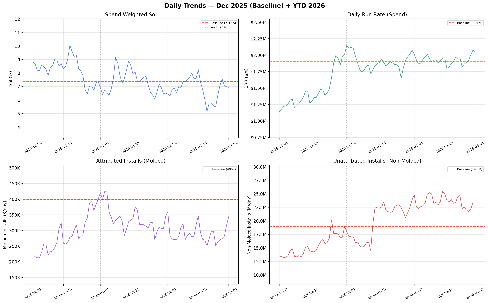

| Metric | Baseline (2025-12-31) | Jan | Feb | Mar |
| :--- | :--- | :--- | :--- | :--- |
| **SoI** | 7.37% | 7.31% (-0.07%) | 6.83% (-0.54%) | 6.94% (-0.43%) |
| **DRR** | $1,906,704 | $1,892,438 (-1%) | $1,923,752 (+1%) | $2,050,930 (+8%) |
| **Moloco Inst/Day** | 399,549 | 336,404 (-16%) | 287,579 (-28%) | 344,384 (-14%) |
| **Non-Moloco Inst/Day** | 18,956,661 | 19,813,994 (+5%) | 23,509,126 (+24%) | 23,501,301 (+24%) |

---

## 2. Top SoI Drivers (March vs Baseline)

### Gaming

**CENTURY_GAMES** | CHN Growth Top 3 | Mar DRR: $698,737 (+42.0%)
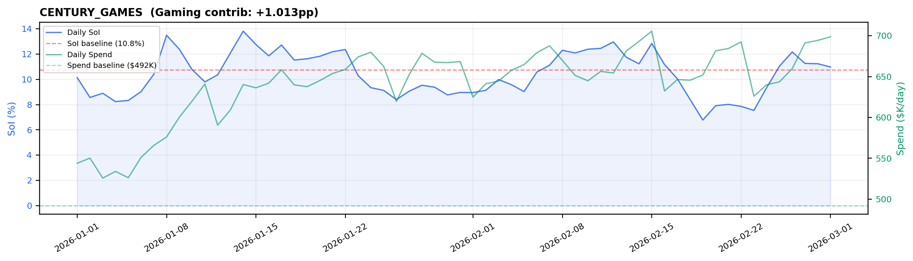
> Mar SoI 11.0% (+0.23%pp vs baseline), contrib +1.013pp — Moloco installs outpacing market (-9% vs unattributed -11%).

**Luckymoney** | CHN Growth Top 2 | Mar DRR: $76,378 (+109.1%)
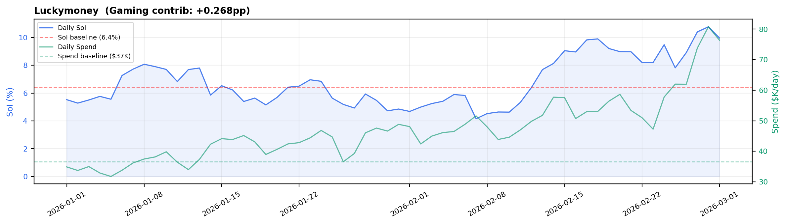
> Mar SoI 10.0% (+3.58%pp vs baseline), contrib +0.268pp — Moloco installs outpacing market (+84% vs unattributed +13%).

**Wedobest_Screw Sort Puzzle_Madhouse_1226_01(VpSvKE3W1NWor3jZ)** | CHN Growth Top 3 | Mar DRR: $99,096 (+140.9%)
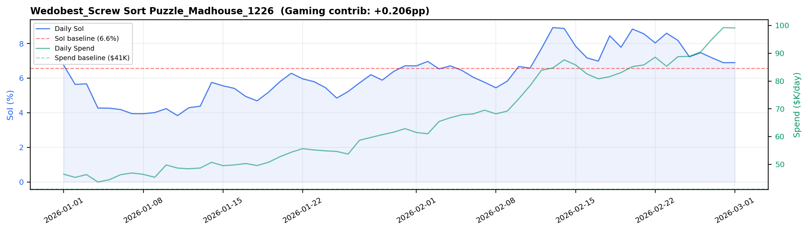
> Mar SoI 6.9% (+0.32%pp vs baseline), contrib +0.206pp — Moloco installs outpacing market (+61% vs unattributed +53%).

---

## 3. Top SoI Drags (March vs Baseline)

### Gaming

**EssentialsTech** | CHN Growth Top 2 | Mar DRR: $83,720 (-9.3%)
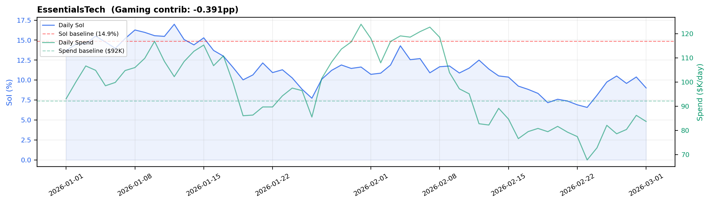
> Mar SoI 9.0% (-5.85%pp vs baseline), contrib -0.391pp — unattributed installs surged (+61%), diluting share despite -9% spend change.

**BITOOL** | CHN Growth Top 3 | Mar DRR: $415,216 (-29.2%)
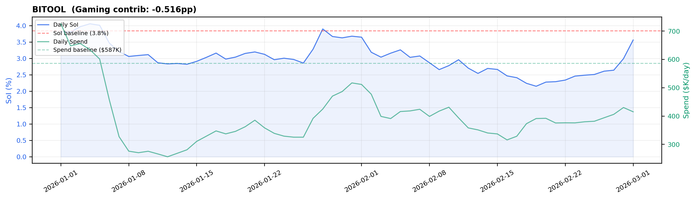
> Mar SoI 3.6% (-0.28%pp vs baseline), contrib -0.516pp — Moloco installs dropped -12%, dragging share down.

**Last Z_IOS_01(drb5MYyoQAzpzZHJ)** | CHN Growth 3 | Mar DRR: $33,920 (-68.2%)
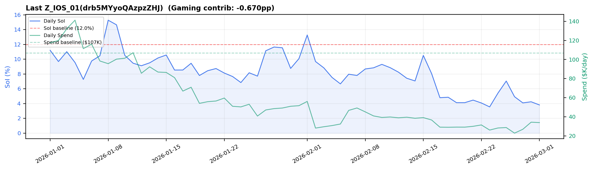
> Mar SoI 3.8% (-8.19%pp vs baseline), contrib -0.670pp — Moloco installs dropped -86%, dragging share down.

### Consumer

**LEMON8** | CHN Growth Top 1 | Mar DRR: $15,280 (-48.5%)
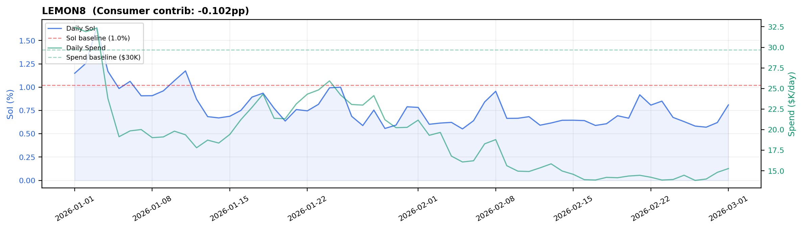
> Mar SoI 0.8% (-0.21%pp vs baseline), contrib -0.102pp — Moloco installs dropped -36%, dragging share down.

**Tigo_Tigo_Madhouse_0108_01(jLDRcRVvxemrL4Q4)** | CHN Growth 1 | Mar DRR: $7,594 (-32.2%)
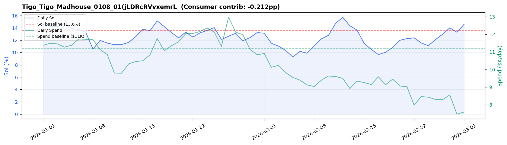
> Mar SoI 14.6% (+0.97%pp vs baseline), contrib -0.212pp — Moloco installs outpacing market (-15% vs unattributed -21%).

**MICO** | CHN Growth Top 1 | Mar DRR: $28,154 (-22.5%)
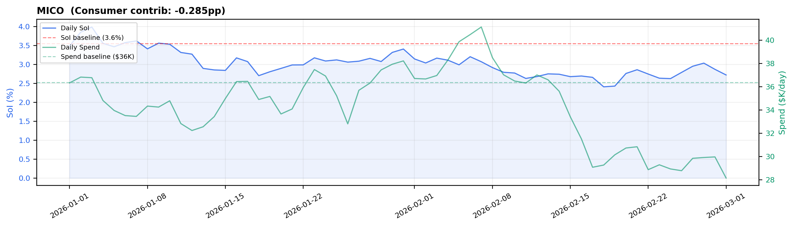
> Mar SoI 2.7% (-0.83%pp vs baseline), contrib -0.285pp — unattributed installs surged (+19%), diluting share despite -23% spend change.

---

## 4. Install & Spend Decomposition (March vs Baseline)

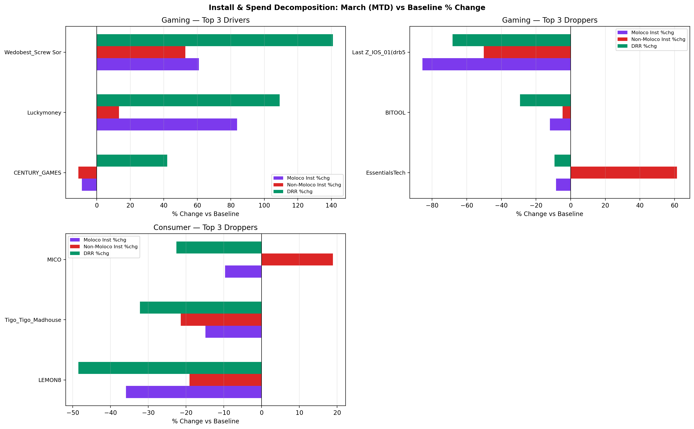

**Gaming:**
- *Drivers* (CENTURY_GAMES, Luckymoney, Wedobest_Screw Sort ): Avg Moloco installs +45%, unattributed +18%, spend +97% vs baseline.
- *Droppers* (EssentialsTech, BITOOL, Last Z_IOS_01(drb5MY): Avg Moloco installs -35%, unattributed +2%, spend -36% vs baseline.

**Consumer:**
- *Droppers* (LEMON8, Tigo_Tigo_Madhouse_0, MICO): Avg Moloco installs -20%, unattributed -7%, spend -34% vs baseline.

---

## 5. All Accounts at a Glance

| Account | Pod | BL SoI | BL DRR | Jan SoI (vs BL) | Jan DRR (vs BL) | Feb SoI (vs BL) | Feb DRR (vs BL) | Mar SoI (vs BL) | Mar DRR (vs BL) | Vert Contrib |
| :--- | :--- | :--- | :--- | :--- | :--- | :--- | :--- | :--- | :--- | :--- |
| **CENTURY_GAMES** | CHN Growth Top 3 | 10.8% | $492,114 | 10.5% (-0.2%) | $619,900 (+26%) | 10.3% (-0.4%) | $662,365 (+35%) | 11.0% (+0.2%) | $698,737 (+42%) | +1.013pp |
| **BITOOL** | CHN Growth Top 3 | 3.8% | $586,718 | 3.4% (-0.5%) | $397,806 (-32%) | 2.7% (-1.1%) | $392,397 (-33%) | 3.6% (-0.3%) | $415,216 (-29%) | -0.516pp |
| **MICROFUN** | CHN Growth Top 3 | 7.1% | $61,269 | 5.3% (-1.8%) | $68,163 (+11%) | 7.0% (-0.1%) | $109,060 (+78%) | 6.5% (-0.6%) | $119,576 (+95%) | +0.163pp |
| **KINGSGROUP** | CHN Growth Top 2 | 13.3% | $103,515 | 11.2% (-2.1%) | $130,388 (+26%) | 9.2% (-4.1%) | $107,037 (+3%) | 7.4% (-5.9%) | $107,059 (+3%) | -0.373pp |
| **TIKTOK_US** | CHN Growth Top 1 | 0.3% | $79,827 | 0.2% (-0.1%) | $82,120 (+3%) | 0.1% (-0.2%) | $92,572 (+16%) | 0.1% (-0.1%) | $99,178 (+24%) | -0.041pp |
| **Learnings** | CHN Growth Top 2 | 1.2% | $25,168 | 1.1% (-0.1%) | $39,036 (+55%) | 0.9% (-0.3%) | $79,901 (+217%) | 1.0% (-0.2%) | $99,915 (+297%) | +0.036pp |
| **Wedobest_Screw Sort Puzzl** | CHN Growth Top 3 | 6.6% | $41,139 | 5.3% (-1.3%) | $51,361 (+25%) | 7.4% (+0.8%) | $79,534 (+93%) | 6.9% (+0.3%) | $99,096 (+141%) | +0.206pp |
| **EssentialsTech** | CHN Growth Top 2 | 14.9% | $92,260 | 13.1% (-1.7%) | $103,066 (+12%) | 10.4% (-4.4%) | $92,895 (+1%) | 9.0% (-5.9%) | $83,720 (-9%) | -0.391pp |
| **Luckymoney** | CHN Growth Top 2 | 6.4% | $36,531 | 6.2% (-0.2%) | $40,189 (+10%) | 7.6% (+1.2%) | $53,167 (+46%) | 10.0% (+3.6%) | $76,378 (+109%) | +0.268pp |
| **LASTWAR** | CHN Growth Top 2 | 3.1% | $69,608 | 4.6% (+1.5%) | $82,688 (+19%) | 7.9% (+4.8%) | $49,723 (-29%) | 6.1% (+3.1%) | $49,750 (-29%) | +0.038pp |
| **MICO** | CHN Growth Top 1 | 3.6% | $36,348 | 3.2% (-0.3%) | $35,148 (-3%) | 2.8% (-0.7%) | $33,863 (-7%) | 2.7% (-0.8%) | $28,154 (-23%) | -0.285pp |
| **Last Z_IOS_01(drb5MYyoQAz** | CHN Growth 3 | 12.0% | $106,795 | 9.9% (-2.1%) | $79,989 (-25%) | 7.3% (-4.7%) | $34,858 (-67%) | 3.8% (-8.2%) | $33,920 (-68%) | -0.670pp |
| **ZerooGravity** | CHN Growth 3 | 6.0% | $11,100 | 4.0% (-2.0%) | $13,196 (+19%) | 3.2% (-2.7%) | $19,412 (+75%) | 5.1% (-0.9%) | $23,456 (+111%) | +0.025pp |
| **TOPGAMES** | CHN Growth Top 2 | 16.8% | $21,444 | 13.8% (-3.0%) | $22,214 (+4%) | 12.7% (-4.1%) | $20,789 (-3%) | 8.4% (-8.4%) | $22,824 (+6%) | -0.106pp |
| **LEMON8** | CHN Growth Top 1 | 1.0% | $29,683 | 0.9% (-0.1%) | $22,467 (-24%) | 0.7% (-0.3%) | $15,603 (-47%) | 0.8% (-0.2%) | $15,280 (-49%) | -0.102pp |
| **AVIAGAMES** | CHN Growth Top 2 | 1.3% | $9,915 | 2.9% (+1.6%) | $17,643 (+78%) | 3.2% (+1.9%) | $16,964 (+71%) | 2.8% (+1.5%) | $13,507 (+36%) | +0.013pp |
| **SPEELEAD** | CHN Growth 3 | 8.9% | $12,514 | 6.6% (-2.3%) | $12,481 (-0%) | 6.1% (-2.8%) | $12,410 (-1%) | 4.7% (-4.2%) | $11,653 (-7%) | -0.035pp |
| **BYTEDANCEPTE** | CHN Growth Top 1 | 0.2% | $12,672 | 0.2% (-0.0%) | $12,197 (-4%) | 0.1% (-0.1%) | $11,471 (-9%) | 0.1% (-0.1%) | $10,987 (-13%) | -0.007pp |
| **Tigo_Tigo_Madhouse_0108_0** | CHN Growth 1 | 13.6% | $11,204 | 13.1% (-0.6%) | $11,381 (+2%) | 11.9% (-1.7%) | $9,176 (-18%) | 14.6% (+1.0%) | $7,594 (-32%) | -0.212pp |
| **37GAMES** | CHN Growth 2 | 3.4% | $2,159 | 2.0% (-1.4%) | $4,704 (+118%) | 3.2% (-0.2%) | $5,737 (+166%) | 2.9% (-0.6%) | $6,640 (+208%) | +0.006pp |
| **Lands of Jail_Madhouse_04** | CHN Growth 2 | 22.2% | $6,969 | 9.2% (-13.0%) | $7,681 (+10%) | 9.5% (-12.7%) | $6,880 (-1%) | 9.2% (-13.0%) | $7,555 (+8%) | -0.052pp |
| **NetEase** | CHN Growth Top 2 | 1.4% | $15,050 | 1.0% (-0.4%) | $11,509 (-24%) | 0.6% (-0.9%) | $8,293 (-45%) | 0.4% (-1.0%) | $7,235 (-52%) | -0.011pp |
| **Dark War Survival_MADHOUS** | CHN Growth 3 | 3.3% | $9,581 | 2.2% (-1.1%) | $7,807 (-19%) | 1.0% (-2.3%) | $5,873 (-39%) | 0.8% (-2.5%) | $5,223 (-45%) | -0.016pp |
| **Mattel163_China** | CHN Growth Top 2 | 2.6% | $840 | 3.2% (+0.6%) | $1,217 (+45%) | 1.6% (-1.0%) | $1,649 (+96%) | 0.6% (-2.0%) | $4,313 (+413%) | +0.000pp |
| **RIVERGAME_HK** | CHN Growth 3 | 6.9% | $31,674 | 6.3% (-0.7%) | $17,862 (-44%) | 2.0% (-4.9%) | $2,122 (-93%) | 14.7% (+7.8%) | $3,965 (-87%) | -0.096pp |

---

> **How to read Vertical Contribution (pp)**
>
> Contribution is calculated **within each vertical** (Gaming and Consumer separately). Each account's contribution measures how many percentage-points it adds to (or subtracts from) its vertical's SoI change vs baseline.
>
> It depends on **two things**: (1) whether the account's SoI went up or down, and (2) how big a slice of its vertical's spend it represents.
>
> - A large-spend Gaming account with a small SoI drop can drag Gaming SoI down significantly (e.g. BITOOL: large share of Gaming spend).
> - A small Consumer account with a big SoI gain barely moves Consumer SoI (small share of Consumer spend).
> - An account can show *negative contribution even when its own SoI improved* — this happens when its spend share within the vertical shrank.
>
> Formula: `contribution = (account Mar SoI × share of vertical Mar spend) − (account baseline SoI × share of vertical baseline spend)`

*Generated 2026-03-14 19:14. All SoI values are spend-weighted. Metrics use March (MTD) average (Mar 1 – 2026-03-01) vs baseline unless noted. Monthly trajectory and Section 1 table show Jan–Mar for context.*