# Weekly Insights: 2026-W23 — YTD vs Benchmark (as of 2026-06-03)

> **Benchmark** = Dec 31, 2025 spend-weighted SoI baseline. **Target** = baseline + 2pp (annual goal). All SoI values are spend-weighted (`moloco installs / (moloco + non-moloco) installs`).

## TLDR

**Overall:** YTD SoI is **7.47%** (+0.09pp vs 7.37% benchmark). Monthly trajectory: 2026-01: 7.31% → 2026-02: 6.83% → 2026-03: 7.46% → 2026-04: 7.32% → 2026-05: 8.31% → 2026-06: 8.22%. The first half was soft (Feb dip to 6.83%), but **May–Jun have run well above benchmark** (8.31% → 8.22% MTD). Gap to the 9.37% target: **+1.91pp** (need +0.28pp/month over the remaining 7 months). YTD run-rate $1,874,299/day.

**Most recent week (2026-W23, 2026-05-28–2026-06-03):** SoI **8.27%** (+0.89pp vs benchmark), -0.34pp WoW from the prior week's 8.61%. Spend $1,666,827/day (-4% WoW). Still comfortably above benchmark despite the slight WoW pullback.

**Why YTD is only +0.09pp despite the strong recent weeks:** install volume, not spend. YTD Moloco installs are **-28%** vs baseline (399,549 → 286,877/day) while unattributed installs are **+27%** (18,956,661 → 24,030,908/day). Spend is roughly flat (-2%). The YTD average is weighed down by the Jan–Apr softness; the trend has since recovered. This is an **install-share problem**, not a budget problem.

**Gaming vs Consumer (YTD vs benchmark):**
- **Gaming:** SoI 8.11% (+0.23pp vs benchmark), 90% of spend, portfolio contribution **+0.149pp** — carries the portfolio.
- **Consumer:** SoI 1.46% (-0.51pp vs benchmark), 10% of spend, portfolio contribution **-0.035pp**.

**Biggest YTD drivers:** **CENTURY_GAMES** (+1.17pp), **Wedobest_Screw Sort Pu** (+0.48pp), **Luckymoney** (+0.34pp). **Biggest YTD drags:** **BITOOL** (-0.87pp), **Last Z_IOS_01(drb5MYyo** (-0.59pp), **EssentialsTech** (-0.37pp).

## Next Steps

- **Fix the largest drag — BITOOL** (-0.87pp): large Gaming spender ($288,833/day) sitting at 2.28% SoI (-1.56pp vs benchmark). Highest-leverage single account to move portfolio SoI.
- **Protect the top drivers** (CENTURY_GAMES, Wedobest_Screw Sort , Luckymoney): all above benchmark and carrying the portfolio — review at app/geo level for headroom and watch for saturation.
- **Consumer (10% of spend, -0.51pp vs benchmark):** low base; decide whether it's a deliberate volume play or needs an attribution/measurement review.
- **Sustain the May–Jun momentum:** recent weeks are tracking toward the 9.37% target — hold the run-rate and keep unattributed-install growth in check to convert the recent trend into the YTD average.

## 1. Overall Trend — Baseline + YTD

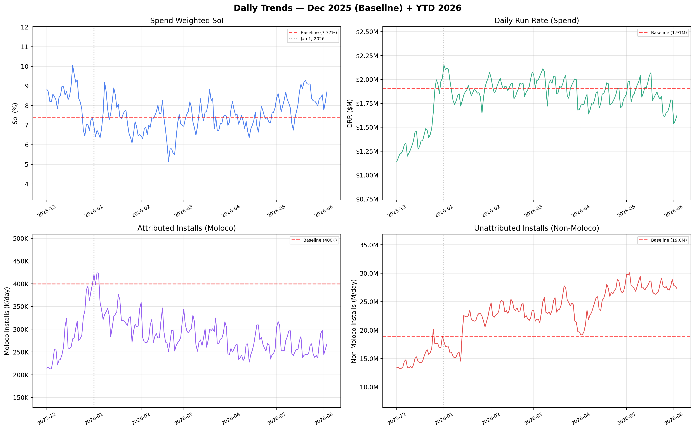

## 2. Weekly SoI vs Benchmark

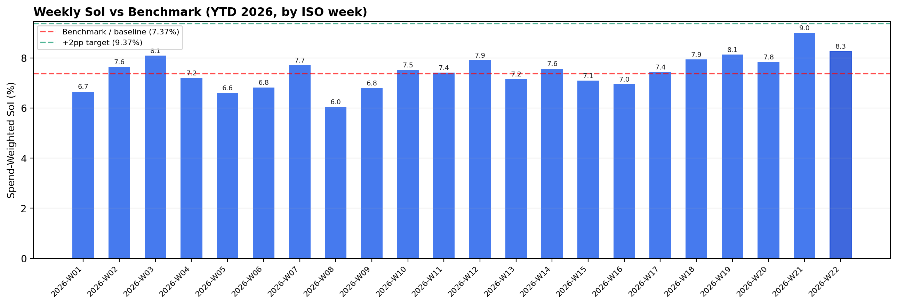

| ISO Week | SoI | vs Benchmark | Avg DRR | Avg Moloco Inst/day | Days |
| :--- | :--- | :--- | :--- | :--- | :--- |
| 2026-W11 | 7.42% | +0.04pp | $1,943,101 | 272,971 | 7 |
| 2026-W12 | 7.92% | +0.54pp | $1,937,511 | 293,427 | 7 |
| 2026-W13 | 7.16% | -0.22pp | $1,922,056 | 286,887 | 7 |
| 2026-W14 | 7.58% | +0.20pp | $1,746,133 | 255,226 | 7 |
| 2026-W15 | 7.10% | -0.28pp | $1,760,767 | 245,193 | 7 |
| 2026-W16 | 6.96% | -0.42pp | $1,852,205 | 271,187 | 7 |
| 2026-W17 | 7.44% | +0.06pp | $1,815,070 | 267,365 | 7 |
| 2026-W18 | 7.95% | +0.57pp | $1,834,879 | 272,814 | 7 |
| 2026-W19 | 8.14% | +0.76pp | $1,900,567 | 272,970 | 7 |
| 2026-W20 | 7.84% | +0.47pp | $1,941,014 | 258,334 | 7 |
| 2026-W21 | 9.00% | +1.63pp | $1,820,234 | 249,545 | 7 |
| 2026-W22 | 8.27% | +0.90pp | $1,689,374 | 259,838 | 7 |

## 3. By Vertical — YTD vs Benchmark

| Vertical | YTD SoI | Benchmark SoI | vs Benchmark | YTD Avg DRR |
| :--- | :--- | :--- | :--- | :--- |
| Gaming | 8.11% | 7.88% | +0.23pp | $1,693,280 |
| Consumer | 1.46% | 1.97% | -0.51pp | $181,019 |

## 4. Account Contribution to YTD SoI vs Benchmark

> YTD contribution = `(account YTD SoI × YTD spend share) − (account baseline SoI × baseline spend share)`, computed within each vertical. It captures both the SoI move and the account's spend weight.

### Gaming

| | Account | Pod | YTD SoI | vs Benchmark | YTD DRR | YTD Contrib |
| :--- | :--- | :--- | :--- | :--- | :--- | :--- |
| ⬆ Driver | **CENTURY_GAMES** | CHN Growth Top 3 | 10.69% | -0.06pp | $695,450 | +1.170pp |
| ⬆ Driver | **Wedobest_Screw Sort Puzzle_M** | CHN Growth Top 3 | 9.85% | +3.27pp | $116,211 | +0.476pp |
| ⬆ Driver | **Luckymoney** | CHN Growth Top 2 | 10.44% | +4.05pp | $82,964 | +0.345pp |
| ⬇ Detractor | **EssentialsTech** | CHN Growth Top 2 | 8.05% | -6.82pp | $86,337 | -0.368pp |
| ⬇ Detractor | **Last Z_IOS_01(drb5MYyoQAzpzZ** | CHN Growth 3 | 6.32% | -5.68pp | $31,342 | -0.590pp |
| ⬇ Detractor | **BITOOL** | CHN Growth Top 3 | 2.28% | -1.56pp | $288,833 | -0.869pp |

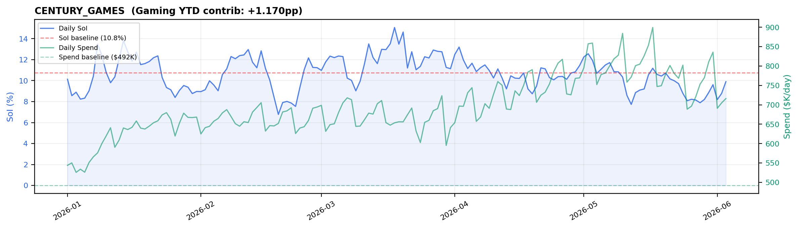

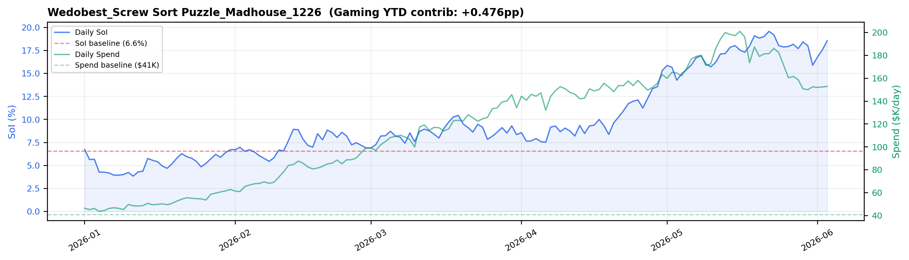

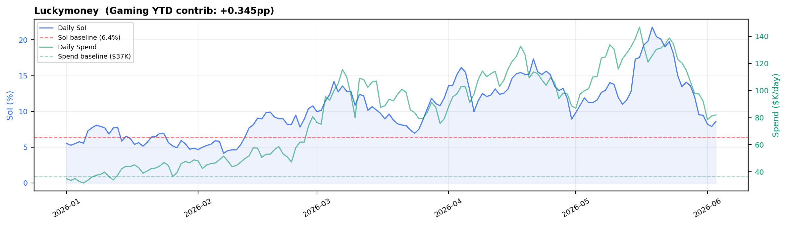

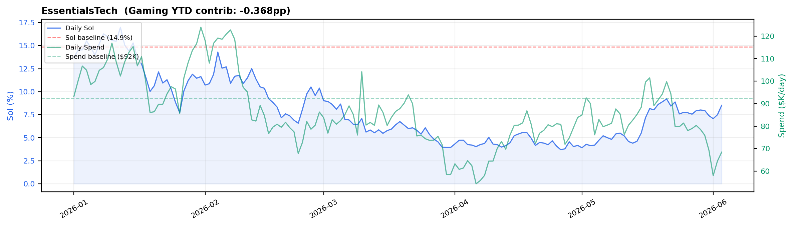

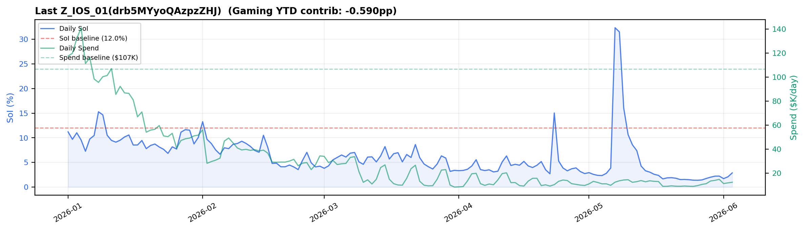

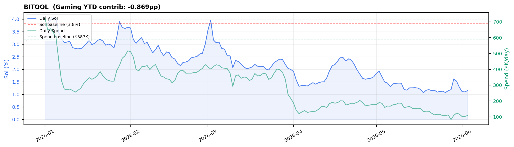

### Consumer

| | Account | Pod | YTD SoI | vs Benchmark | YTD DRR | YTD Contrib |
| :--- | :--- | :--- | :--- | :--- | :--- | :--- |
| ⬆ Driver | **LEMON8** | CHN Growth Top 1 | 1.67% | +0.65pp | $19,456 | +0.001pp |
| ⬇ Detractor | **TIKTOK_US** | CHN Growth Top 1 | 0.16% | -0.11pp | $110,997 | -0.002pp |
| ⬇ Detractor | **Tigo_Tigo_Madhouse_0108_01(j** | CHN Growth 1 | 12.06% | -1.56pp | $9,878 | -0.018pp |
| ⬇ Detractor | **MICO** | CHN Growth Top 1 | 3.05% | -0.50pp | $29,716 | -0.021pp |

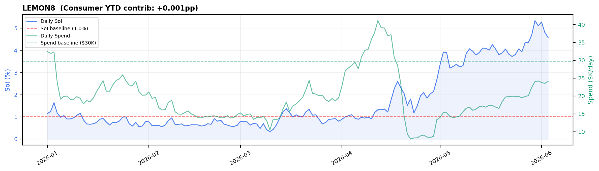

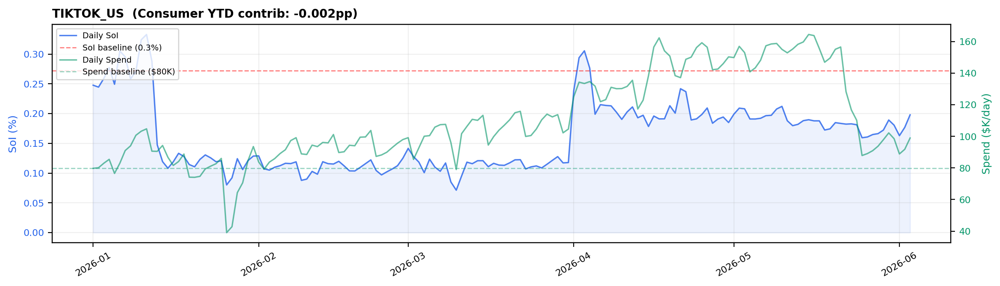

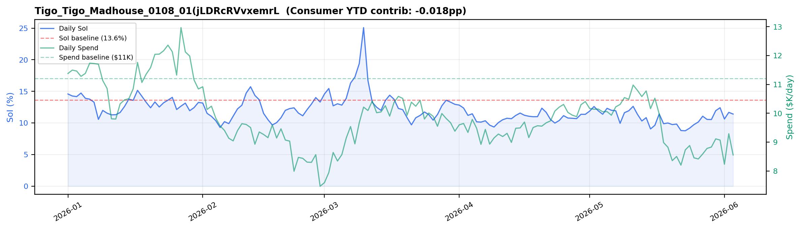

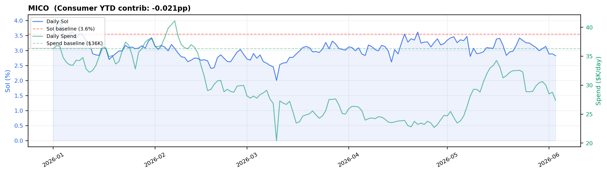

---

## 5. All Accounts — YTD vs Benchmark

| Account | Pod | Vertical | Benchmark SoI | YTD SoI | vs Benchmark | YTD DRR | YTD Contrib |
| :--- | :--- | :--- | :--- | :--- | :--- | :--- | :--- |
| **CENTURY_GAMES** | CHN Growth Top 3 | Gaming | 10.75% | 10.69% | -0.06pp | $695,450 | +1.170pp |
| **BITOOL** | CHN Growth Top 3 | Gaming | 3.85% | 2.28% | -1.56pp | $288,833 | -0.869pp |
| **Wedobest_Screw Sort Puzzl** | CHN Growth Top 3 | Gaming | 6.58% | 9.85% | +3.27pp | $116,211 | +0.476pp |
| **TIKTOK_US** | CHN Growth Top 1 | Consumer | 0.27% | 0.16% | -0.11pp | $110,997 | -0.002pp |
| **MICROFUN** | CHN Growth Top 3 | Gaming | 7.08% | 6.04% | -1.04pp | $96,650 | +0.082pp |
| **EssentialsTech** | CHN Growth Top 2 | Gaming | 14.87% | 8.05% | -6.82pp | $86,337 | -0.368pp |
| **Luckymoney** | CHN Growth Top 2 | Gaming | 6.39% | 10.44% | +4.05pp | $82,964 | +0.345pp |
| **KINGSGROUP** | CHN Growth Top 2 | Gaming | 13.30% | 8.79% | -4.51pp | $80,769 | -0.363pp |
| **Learnings** | CHN Growth Top 2 | Gaming | 1.18% | 0.72% | -0.46pp | $73,639 | +0.013pp |
| **Last Z_IOS_01(drb5MYyoQAz** | CHN Growth 3 | Gaming | 12.00% | 6.32% | -5.68pp | $31,342 | -0.590pp |
| **MICO** | CHN Growth Top 1 | Consumer | 3.55% | 3.05% | -0.50pp | $29,716 | -0.021pp |
| **ZerooGravity** | CHN Growth 3 | Gaming | 5.98% | 4.22% | -1.75pp | $24,880 | +0.021pp |
| **LEMON8** | CHN Growth Top 1 | Consumer | 1.02% | 1.67% | +0.65pp | $19,456 | +0.001pp |
| **TOPGAMES** | CHN Growth Top 2 | Gaming | 16.79% | 11.16% | -5.64pp | $18,527 | -0.083pp |
| **AVIAGAMES** | CHN Growth Top 2 | Gaming | 1.29% | 4.25% | +2.96pp | $13,576 | +0.024pp |
| **SPEELEAD** | CHN Growth 3 | Gaming | 8.91% | 6.00% | -2.90pp | $11,375 | -0.023pp |
| **BYTEDANCEPTE** | CHN Growth Top 1 | Consumer | 0.21% | 0.23% | +0.01pp | $10,926 | -0.000pp |
| **Tigo_Tigo_Madhouse_0108_0** | CHN Growth 1 | Consumer | 13.62% | 12.06% | -1.56pp | $9,878 | -0.018pp |
| **NetEase** | CHN Growth Top 2 | Gaming | 1.42% | 0.55% | -0.87pp | $7,808 | -0.009pp |
| **Lands of Jail_Madhouse_04** | CHN Growth 2 | Gaming | 22.22% | 7.76% | -14.46pp | $6,808 | -0.056pp |
| **RIVERGAME_HK** | CHN Growth 3 | Gaming | 6.94% | 3.11% | -3.83pp | $6,274 | -0.109pp |
| **Dark War Survival_MADHOUS** | CHN Growth 3 | Gaming | 3.32% | 1.46% | -1.86pp | $5,829 | -0.013pp |
| **37GAMES** | CHN Growth 2 | Gaming | 3.42% | 2.86% | -0.56pp | $4,919 | +0.004pp |
| **Mattel163_China** | CHN Growth Top 2 | Gaming | 2.58% | 1.28% | -1.30pp | $2,749 | +0.001pp |

*Generated from full_premium_raw_data.csv (2026-01-01 – 2026-06-03). Spend-weighted SoI throughout. Benchmark = Dec 31, 2025 baseline; target = +2pp.*